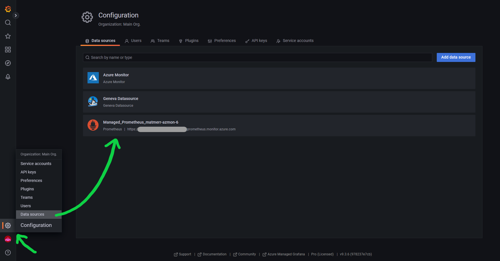

# Configuring Grafana

## Pre-Requisites

Follow either:

- [Unmanaged Prometheus/Grafana](./prometheus-unmanaged.md) or
- [Azure-Hosted Prometheus/Grafana](prometheus-azure-managed.md).

Make sure that you're still port-forwarding your server to localhost:9090, or configure your server for some other HTTP endpoint.

## Configuration

1. Check Grafana to make sure the managed Prometheus datasource exists:

   

2. Go to the dashboard page and select "import":

   

3. Import the [published dashboards](https://grafana.com/grafana/dashboards/) by ID, or import the dashboards by JSON at *deploy/grafana/dashboards/*.

4. The Grafana dashboard should now be visible.

   

FIXME add published dashboard links

## Pre-Installed Dashboards

If you're using [Azure-Hosted Prometheus/Grafana](prometheus-azure-managed.md), versions of these dashbaords are pre-installed under:

- Dashboards > Managed Prometheus > Kubernetes / Networking / Clusters
- Dashboards > Managed Prometheus > Kubernetes / Networking / DNS
